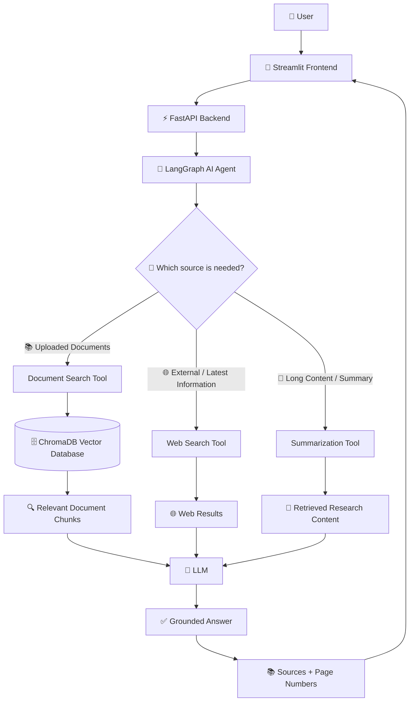
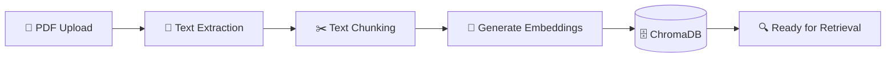
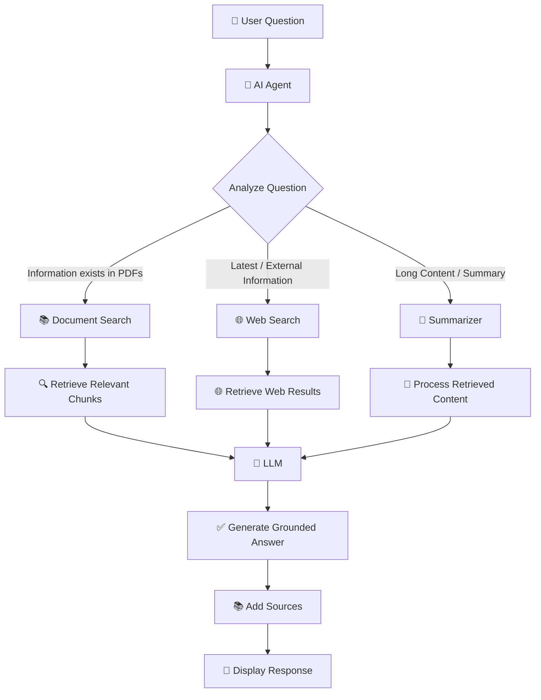

# agentic-rag-research-assistant
An AI-powered Agentic RAG Research Assistant that answers questions from uploaded research papers using intelligent document retrieval, web search, and LLM-based reasoning with source citations.


# 🤖 Agentic RAG Research Assistant

> **An AI-powered research assistant that combines Retrieval-Augmented Generation (RAG), AI Agents, vector search, web search, and Large Language Models to provide accurate, context-aware answers with source citations.**

---

## 📌 Overview

The **Agentic RAG Research Assistant** is an AI-powered application designed to help researchers interact with research papers and documents using natural language.

Users can upload one or multiple PDF research papers and ask questions about their content. Instead of simply searching documents using a fixed RAG pipeline, the system uses an **AI Agent** to intelligently decide which information source should be used.

The agent can:

* 📚 Search uploaded research papers
* 🌐 Search the web when external information is required
* 📝 Summarize research content
* 🔍 Retrieve relevant document sections
* 🧠 Generate grounded answers using an LLM
* 📄 Provide source and page-level citations

The main goal is to create a practical **Agentic AI + RAG system** that can assist researchers in understanding, searching, comparing, and summarizing technical documents.

---

# 🎯 Problem Statement

Researchers often need to read multiple long research papers to find specific information, compare methodologies, understand technical concepts, and summarize findings.

Traditional document chatbots usually follow a fixed workflow:

```text
Question → Search Documents → Generate Answer
```

This approach does not intelligently decide whether the answer should come from the uploaded documents or from external sources.

The proposed system improves this workflow by introducing an **AI Agent** that dynamically selects the most appropriate tool based on the user's question.

---

# 💡 Proposed Solution

The system combines:

* **Retrieval-Augmented Generation (RAG)**
* **AI Agent orchestration**
* **Vector database**
* **Semantic document search**
* **Web search**
* **LLM-based answer generation**
* **Source-aware responses**

The agent analyzes the user's question and chooses the appropriate information source before generating the final answer.

---

# 🏗️ System Architecture



---

# 🔄 How the System Works

The complete workflow consists of two major pipelines:

## 1. 📄 Document Processing Pipeline

When a user uploads a PDF:



### Step-by-step

**Step 1 — PDF Upload**

The user uploads one or multiple research papers through the frontend.

**Step 2 — Text Extraction**

The backend extracts text from the PDF while preserving page information.

**Step 3 — Chunking**

Long documents are divided into smaller meaningful chunks.

**Step 4 — Embeddings**

Each chunk is converted into a numerical vector representation using an embedding model.

**Step 5 — Vector Storage**

The embeddings and their metadata are stored in ChromaDB.

Metadata includes:

```text
filename
page_number
chunk_id
```

This allows the system to identify exactly where retrieved information came from.

---

# 🧠 Agentic Question-Answering Workflow

When the user asks a question:



---

# 🔀 Agent Decision Making

The most important part of this project is the **AI Agent**.

The agent does not blindly use the same tool for every question.

### Example 1 — Document Question

**User:**

> What are the advantages of RAG discussed in the uploaded paper?

**Agent:**

```text
Question
   ↓
Document Search
   ↓
ChromaDB
   ↓
Relevant Chunks
   ↓
LLM
   ↓
Answer + Page Citation
```

---

### Example 2 — Latest Information

**User:**

> What are the latest developments in RAG?

**Agent:**

```text
Question
   ↓
Web Search
   ↓
External Results
   ↓
LLM
   ↓
Answer + Web Sources
```

---

### Example 3 — Research Comparison

**User:**

> Compare the approaches used in these two papers.

**Agent:**

```text
Question
   ↓
Document Search
   ↓
Paper 1 + Paper 2
   ↓
Relevant Chunks
   ↓
Summarization / Analysis
   ↓
LLM
   ↓
Comparison
```

---

# 📚 What is RAG?

**Retrieval-Augmented Generation (RAG)** is a technique that allows an LLM to retrieve relevant information from an external knowledge source before generating an answer.

Instead of relying only on the model's internal knowledge:

```text
User Question
      ↓
Retrieve Relevant Information
      ↓
Provide Context to LLM
      ↓
Generate Grounded Answer
```

In this project, the external knowledge source is primarily the user's uploaded research papers stored in **ChromaDB**.

---

# 🤖 What Makes This Project Agentic?

A traditional RAG system generally follows:

```text
Question
   ↓
Retriever
   ↓
LLM
   ↓
Answer
```

This project introduces an AI Agent:

```text
Question
   ↓
AI Agent
   ↓
Decide What Tool to Use
   ↓
┌──────────────┬──────────────┬──────────────┐
│              │              │
RAG Search   Web Search   Summarization
│              │              │
└──────────────┴──────────────┴──────────────┘
                    ↓
                   LLM
                    ↓
              Final Answer
```

This makes the system more flexible and capable of handling different types of research questions.

---

# ✨ Key Features

* 📄 **Multiple PDF Upload**
* 📚 **Research Paper Q&A**
* 🔍 **Semantic Vector Search**
* 🤖 **Agentic RAG**
* 🧠 **LangGraph Agent**
* 🌐 **Web Search**
* 📝 **Document Summarization**
* 📊 **Multi-document Comparison**
* 📚 **Source Citations**
* 📄 **Page-level References**
* 💬 **Conversational Interface**
* ⚡ **FastAPI Backend**
* 🎨 **Streamlit Frontend**
* 🗄️ **ChromaDB Vector Database**
* 🧪 **Testing & Evaluation**
* 📝 **Application Logging**
* 🔐 **Environment-based API Configuration**

---

# 🛠️ Technology Stack

| Category             | Technology                    |
| -------------------- | ----------------------------- |
| Programming Language | Python                        |
| Frontend             | Streamlit                     |
| Backend              | FastAPI                       |
| Agent Framework      | LangGraph                     |
| LLM Framework        | LangChain                     |
| Vector Database      | ChromaDB                      |
| PDF Processing       | PyPDF                         |
| Embeddings           | HuggingFace / Embedding Model |
| LLM                  | OpenAI API                    |
| Web Search           | Web Search Tool/API           |
| Testing              | Pytest                        |
| Configuration        | Python-dotenv                 |

---

# 📁 Project Structure

```text
agentic-rag-research-assistant/
│
├── backend/
│   ├── main.py
│   ├── config.py
│   │
│   ├── api/
│   │   ├── upload.py
│   │   └── chat.py
│   │
│   ├── agent/
│   │   ├── state.py
│   │   ├── graph.py
│   │   ├── tools.py
│   │   └── prompts.py
│   │
│   ├── rag/
│   │   ├── loader.py
│   │   ├── chunker.py
│   │   ├── embeddings.py
│   │   └── retriever.py
│   │
│   └── services/
│       └── llm.py
│
├── frontend/
│   └── app.py
│
├── evaluation/
│   ├── questions.json
│   ├── evaluate.py
│   └── README.md
│
├── tests/
│   ├── test_health.py
│   ├── test_upload.py
│   ├── test_retrieval.py
│   └── test_agent.py
│
├── screenshots/
│   ├── dashboard.png
│   ├── documents.png
│   ├── web-search.png
│   ├── source-preview.png
│   └── system-status.png
│
├── data/
│   └── .gitkeep
│
├── .env.example
├── .gitignore
├── requirements.txt
├── README.md
└── LICENSE
```

---

# 🖥️ Frontend

The application provides a clean research-focused interface built with Streamlit.

### Main Screens

### 🏠 Dashboard / Chat

Users can ask questions and receive AI-generated responses.

### 📚 Documents

Users can view uploaded research papers and their processing status.

### 📤 Upload Documents

Users can upload one or multiple PDF files.

### 🌐 Agentic Web Search

When the agent determines that external information is required, web search results are displayed.

### 📄 Source Preview

Users can identify the document and page from which the answer was retrieved.

### ⚙️ Settings

Users can configure available model and retrieval settings.

### 📊 System Status

The application can display the status of:

* Backend API
* ChromaDB
* LLM service
* AI Agent
* Web Search

---

# 🔌 Backend API

The FastAPI backend exposes endpoints for document processing and question answering.

## Health Check

```text
GET /health
```

Checks whether the backend is running.

## Upload PDF

```text
POST /upload
```

Uploads and indexes research papers.

## Ask Question

```text
POST /chat
```

Example request:

```json
{
  "question": "What are the main advantages of RAG?"
}
```

Example response:

```json
{
  "answer": "RAG improves...",
  "tool_used": "document_search",
  "sources": [
    {
      "filename": "RAG_Survey.pdf",
      "page": 4
    }
  ]
}
```

---

# 🔐 Environment Variables

Create a `.env` file:

```text
OPENAI_API_KEY=your_api_key_here
MODEL_NAME=your_model_name
BACKEND_URL=http://localhost:8000
```

> ⚠️ Never commit `.env` or real API keys to GitHub.

Use `.env.example` as a template.

---

# ⚙️ Installation

## 1. Clone the Repository

```bash
git clone YOUR_GITHUB_REPOSITORY_URL

cd agentic-rag-research-assistant
```

## 2. Create Virtual Environment

### Windows

```bash
python -m venv venv

venv\Scripts\activate
```

### Linux / macOS

```bash
python3 -m venv venv

source venv/bin/activate
```

## 3. Install Dependencies

```bash
pip install -r requirements.txt
```

## 4. Configure Environment

Create `.env` from `.env.example` and add your API credentials.

## 5. Start Backend

```bash
uvicorn backend.main:app --reload
```

Backend:

```text
http://localhost:8000
```

Swagger API documentation:

```text
http://localhost:8000/docs
```

## 6. Start Frontend

Open another terminal:

```bash
streamlit run frontend/app.py
```

The application will open in your browser.

---

# 🧪 Testing

The project includes tests for important components.

Run:

```bash
pytest
```

Testing covers:

* Backend health
* PDF upload
* Document retrieval
* Agent workflow
* API responses

---

# 📊 Evaluation

A small evaluation dataset is included to assess the system.

The evaluation focuses on:

* Retrieval relevance
* Answer correctness
* Citation accuracy
* Agent tool selection

Example evaluation flow:

```text
Question
   ↓
Agent Decision
   ↓
Selected Tool
   ↓
Retrieved Context
   ↓
Generated Answer
   ↓
Evaluation
```

---

# 💬 Example Queries

### Document Questions

> What is the main contribution of this paper?

> What methodology was used in this research?

> What are the limitations mentioned by the authors?

### Summarization

> Summarize this research paper.

> Explain the methodology in simple terms.

### Comparison

> Compare the approaches used in these two papers.

> Which method performs better according to the papers?

### Web Search

> What are the latest developments in Agentic RAG?

> What are the current challenges in RAG systems?

---


# 🔒 Security Considerations

* API keys are stored using environment variables.
* `.env` is excluded from version control.
* Sensitive credentials are never included in logs.
* User documents should be handled carefully.
* The application avoids exposing internal agent reasoning.

---

# ⚠️ Limitations

The current version has some limitations:

* PDF quality can affect text extraction.
* Scanned/image-only PDFs may require OCR.
* Retrieval quality depends on chunking and embedding quality.
* Web search results depend on the configured search provider.
* LLM responses should still be reviewed for critical research use.

---

# 🔮 Future Improvements

Potential future enhancements include:

* 🔄 Advanced document reranking
* 🧠 Multi-agent research workflows
* 📑 Automatic research report generation
* 🔍 Citation verification
* 💾 Persistent conversation memory
* 🌍 Multilingual document support
* 📊 Advanced RAG evaluation
* ☁️ Cloud deployment
* 🔐 User authentication
* 📚 Automatic literature review generation

---

# 🎓 Learning Outcomes

This project demonstrates practical experience with:

* Retrieval-Augmented Generation
* Agentic AI
* LLM application development
* Vector databases
* Semantic search
* LangChain
* LangGraph
* FastAPI
* Streamlit
* Prompt engineering
* API integration
* Document processing
* AI system evaluation

---

# 🤝 Contributing

Contributions, suggestions, and improvements are welcome.

1. Fork the repository
2. Create a feature branch
3. Make your changes
4. Commit your changes
5. Open a Pull Request

---

# 📄 License

This project is available under the MIT License.

---

# 👩‍💻 Author

## Azqa Jafar

**AI Developer | Software Engineering**

Interested in:

* 🤖 Artificial Intelligence
* 🧠 Generative AI
* 🔗 RAG Systems
* 🧩 AI Agents
* 📊 Machine Learning
* 💻 LLM Applications

---

## ⭐ Project Highlights

> **Agentic AI + RAG + Vector Database + Web Search + LLM + FastAPI + Streamlit**

This project demonstrates how an AI agent can intelligently select information sources and generate grounded research answers with relevant citations.


